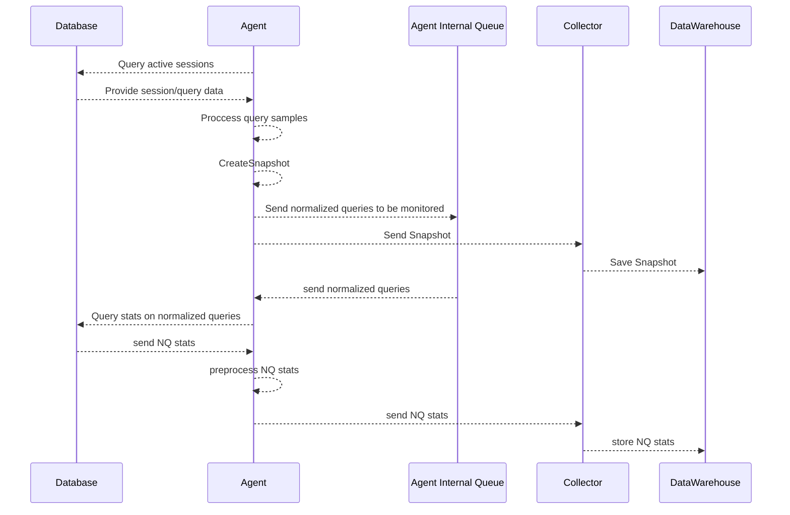

## databases
- active connections
- blocking history
- session graphs
- top queries
- deadlocks

## db snapshots
- samples from snapshot
- blocking tree
- wait events
- time elapsed

## sample
- link to normalized query
- details
- exec plan
- blocking tree

## normalized query
- statistics
- link to samples
- execution plan history
- blocking history

