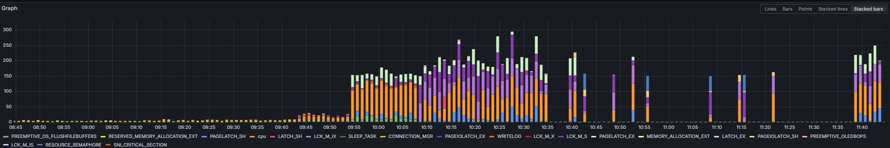
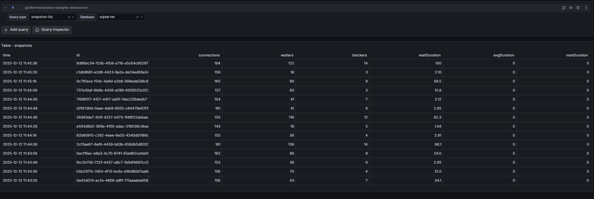
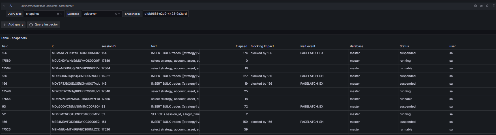
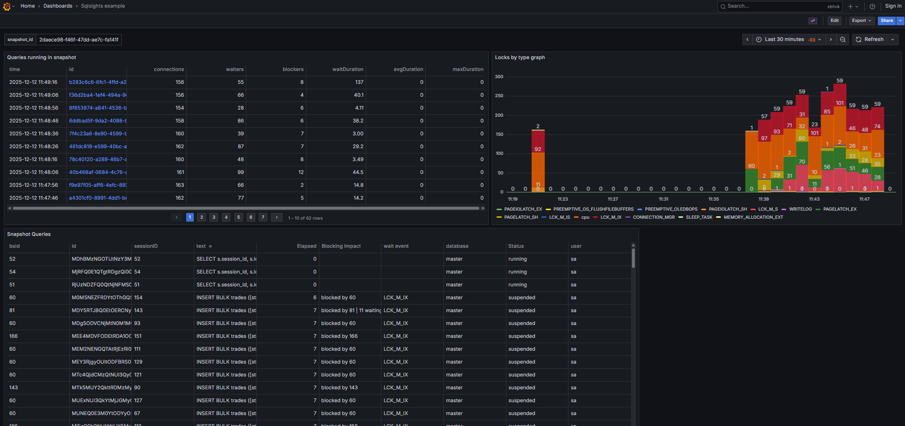

# Sqlsights
Sqlsights is a open source database monitoring project to collect and extract insights from production databases, allowing easy debugging of problems and retrieving insights on potential improvements on your applications

This tool is for those who have database-heavy applications, that sometimes underperform, so you can quickly and autonomously see long running queries, locks, inspect execution plans and gather insights on how to enhance your app without a DB admin, empowering the developers and allowing them to work more autonomously

So far only supports MS Sql Server databases
# Core Features
| Feature Group     | Feature                               | Stage    | Release |
|-------------------|---------------------------------------|----------|---------|
| Session Snapshots | Session Snapshots                     | Released | v1.0.0  |
| Session Snapshots | Lock/Wait detection                   | Released | v1.0.0  |
| Normalized Query  | Execution plan extraction             | Released | v1.0.0  |
| Normalized Query  | Query Stats                           | Released | v1.0.0  |
| Normalized Query  | Execution plan history                | planned  | TBD     |
| Normalized Query  | deadlock detection                    | planned  | TBD     |
| Session Snapshots | Summary data (queries/s, connections) | planned  | TBD     |
| Normalized Query  | Lock history                          | planned  | TBD     |
| Metrics           | Prometheus lock metrics for alerting  | Beta     | TBD     |

# Grafana plugin
The sqlsights grafana plugin allows visualization of the collected data through grafana, so you can onboard it on your monitoring dashboards
It includes a datasource plugin bundled and will include pre-built pages for easier exploration and analysis


# Grafana Sqlsights datasource
## Configuration
for now, configure the app plugin with host:port to your sqlsights instance


## Query types

### Block chart

queries-by-wait-type chart data

### Snapshots
lists snapshot summaries

### Snapshot Samples
given a snapshot id, shows the query samples that were running at that time


## Example dashboard
dashboard combining the queries, with a data link on snapshot id so we can navigate between the snapshots


## Configuration


## Contributing

Got ideas or feedback? Your contributions help make this plugin better. Share your thoughts and code improvements on GitHub.

## Creating PRs

1. Clone the repository
2. Create a dev branch

3. Install dependencies

   ```bash
   npm install
   ```

4. Build plugin in development mode and run in watch mode

   ```bash
   npm run dev
   ```

5. Build plugin in production mode

   ```bash
   npm run build
   ```

6. Run the tests (using Jest)

   ```bash
   # Runs the tests and watches for changes, requires git init first
   npm run test

   # Exits after running all the tests
   npm run test:ci
   ```

7. Spin up a Grafana instance and run the plugin inside it (using Docker)

   ```bash
   npm run server
   ```

8. Run the E2E tests (using Cypress)

   ```bash
   # Spins up a Grafana instance first that we test against
   npm run server

   # Starts the tests
   npm run e2e
   ```

9. Run the linter

   ```bash
   npm run lint

   # or

   npm run lint:fix
   ```

## License

This plugin is licensed under the Apache-2.0 license.