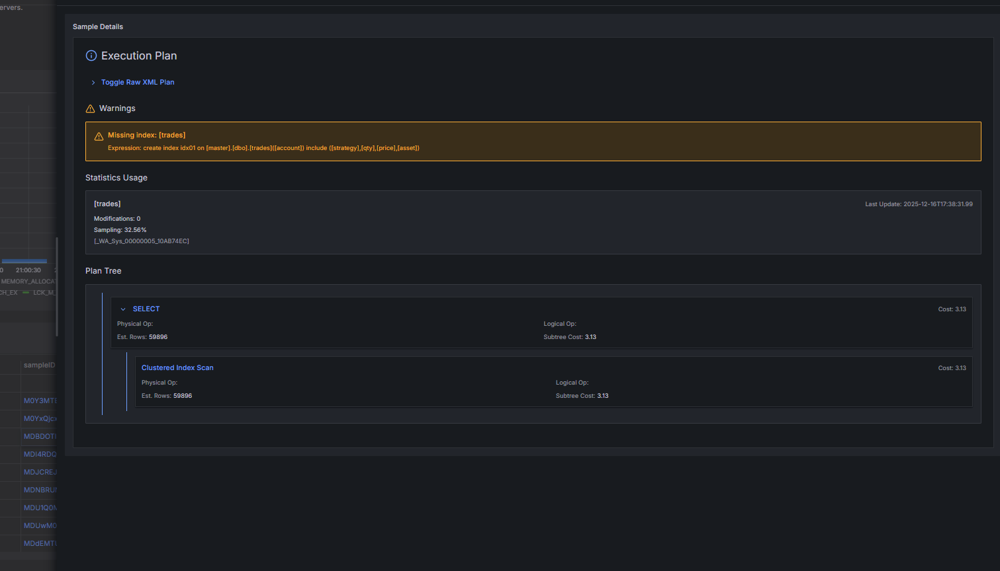
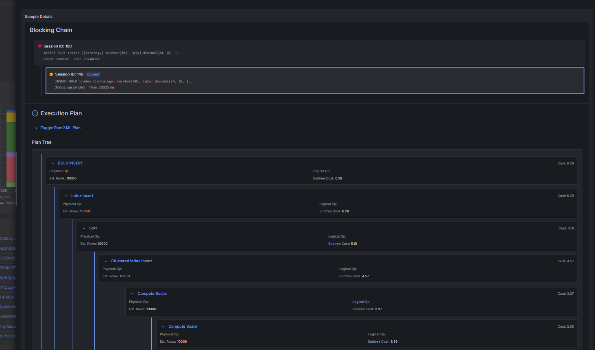

## run test setup locally
```bash
docker compose up
```

this will spin up:
1. a postgres instance to use for sqlsights storage
2. otel-collector and jaeger for tracing (TODO: replace with tempo on grafana image, like lgtm)
3. a grafana instance with the sqlsights plugin installed, already with datasource configured and example dashboard
4. a sql server instance to be monitored
5. a load generation container, to hit the sqlserver with both read and write queries
6. containers for the multiple parts of sqlsights
   1. migrate container to apply postgres migrations
   2. collector - exposes gRPC endpoints for data ingestion
   3. agent - reads from sqlserver, pre-processes data and sends to collector
   4. sqlsights-grpc - exposes gRPC endpoints for querying data collected
   5. ui - htmx-based ui for sqlsights - deprecated

## app plugin functionality
navigate to http://localhost:3000/a/guilhermearpassos-sqlsights-app/one
### chart and snapshots list
select on the combobox a server to inspect

1. dragging/boxing the chart applies/changes the timerange selection in the top right
2. the table contains headline data line # of connections, blocking and waiting connections and wait times
2. clicking on the expand symbol on any snapshot row will open the snapshot, fetching the query samples the were running at that moment

### query samples data
query samples session by session at that timestamp

1. basic data to find what was running on the server at that moment, which queries locked which, time elapsed, waiting reason, database, user
2. clicking on the sampleID values will open a drawer with some more details

### query details
more details on a query sample


1. blocking chain, if any (if that session participates in a blocking chain, it will be rendered with all other sessions involved)
2. execution plan, if available (if sqlsights has the execution plan for that sample, it will render it, also allowing to easily extract the raw xml plan)
3. warnings, if any (warnings extracted from the execution plan, more to be added, like slleping sessions in blocking-chain)